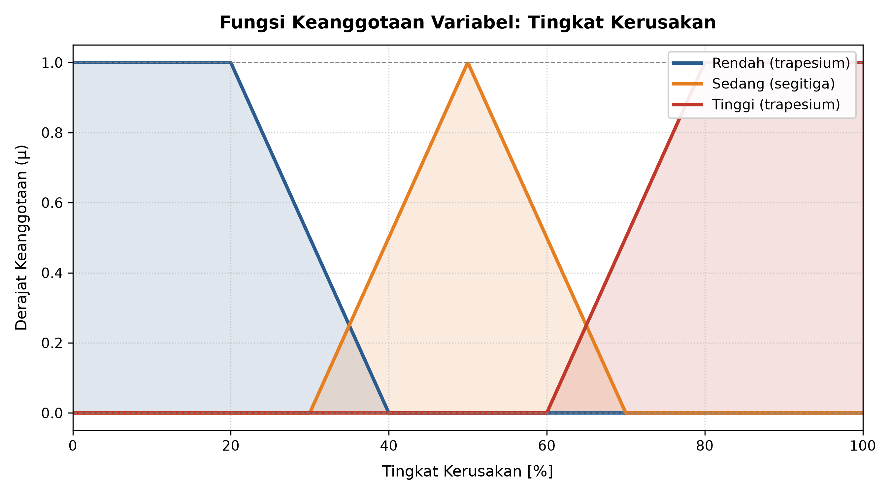
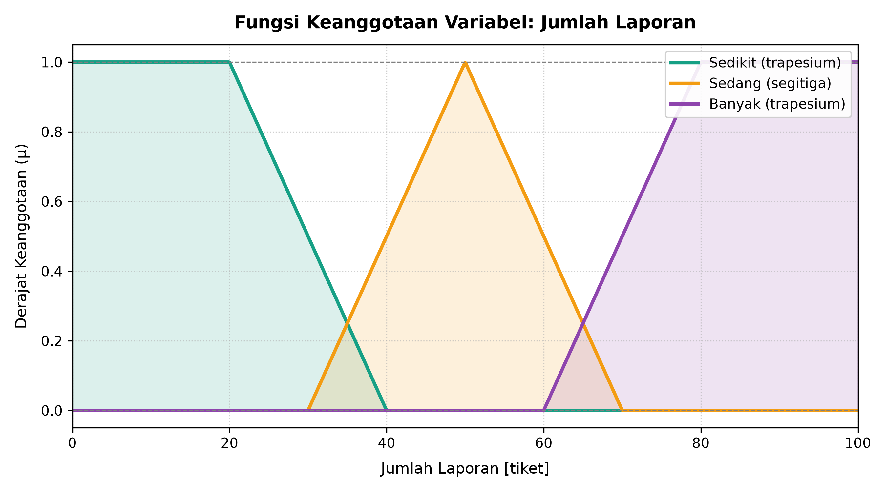
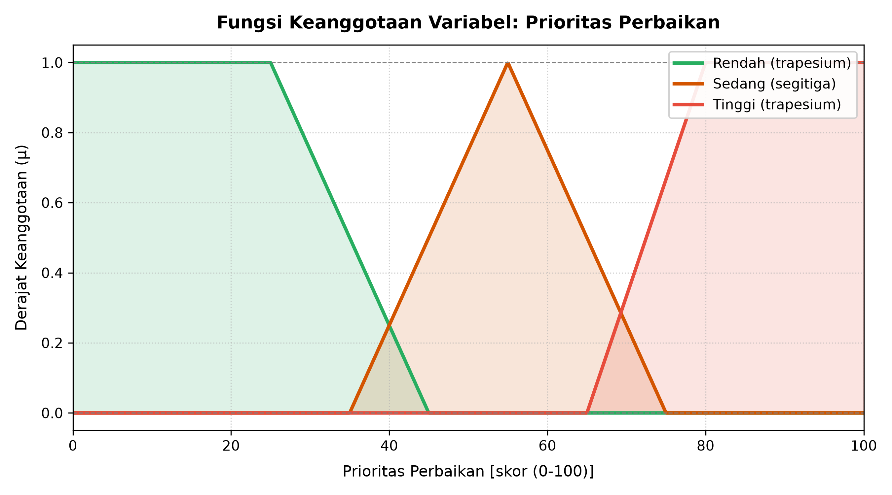

# LAPORAN ASESMEN MODUL 1 — PEMODELAN FUZZY
## Proyek Final Praktikum Tahap 1: Fuzzy Modeling (Bobot: 20%)

---

## 1. JUDUL PROYEK & IDENTITAS MAHASISWA

### 1.1 Identitas Mahasiswa & Informasi Proyek

| Komponen Identitas | Keterangan / Data Mahasiswa |
| :--- | :--- |
| **Judul Proyek** | **Sistem Penentuan Prioritas Perbaikan Fasilitas Kampus Berbasis Logika Fuzzy pada Lingkungan Smart Campus** |
| **Nama Mahasiswa** | **Asfal Fuad** |
| **Nomor Induk Mahasiswa (NIM)** | **240306031** |
| **Program Studi** | S1 Teknologi Informasi |
| **Fakultas** | Fakultas Dakwah dan Ilmu Komunikasi |
| **Perguruan Tinggi** | Universitas Islam Negeri (UIN) Mataram |
| **Mata Kuliah** | Logika Fuzzy |
| **Modul / Pertemuan** | Modul 1 — Praktikum 5 (Asesmen Pemodelan Fuzzy) |
| **Tema Permasalahan** | Bidang Smart Campus (Manajemen Sarana & Prasarana) |
| **Tautan Repositori GitHub** | [https://github.com/Asfalfuadd/logika_fuzzy/tree/main/Modul-1](https://github.com/Asfalfuadd/logika_fuzzy/tree/main/Modul-1) |
| **Tahun Akademik** | 2026 |

---

## 2. LATAR BELAKANG & DESKRIPSI PERMASALAHAN

### 2.1 Latar Belakang Masalah
Dalam ekosistem *Smart Campus*, ketersediaan dan keandalan fasilitas fisik maupun teknologi informasi (seperti komputer laboratorium, proyektor ruang kuliah, pendingin ruangan/AC, access point Wi-Fi, dan sarana sanitasi) merupakan faktor krusial yang menentukan kenyamanan serta kelancaran kegiatan Tri Dharma Perguruan Tinggi. Namun, seiring tingginya mobilitas civitas akademika, kerusakan fasilitas kampus merupakan keniscayaan yang terjadi hampir setiap hari.

Unit pengelola sarana dan prasarana (Sarpras) serta tim helpdesk TI kampus kerap dihadapkan pada keterbatasan sumber daya manusia (teknisi), ketersediaan suku cadang (*spare parts*), dan anggaran pemeliharaan berkala. Di sisi lain, laporan kerusakan yang masuk melalui saluran helpdesk memiliki karakteristik yang beragam, mulai dari laporan kerusakan minor yang dilaporkan oleh satu orang hingga kerusakan fasilitas vital yang dilaporkan oleh puluhan pengguna secara bersamaan.

### 2.2 Kelemahan Pendekatan Logika Tegas (*Crisp Logic*)
Selama ini, klasifikasi antrean perbaikan fasilitas umumnya masih menggunakan pendekatan manual atau aturan tegas (*crisp if-else*). Pendekatan ini memiliki kelemahan mendasar berupa efek tebing (*cliff effect*) atau kekakuan batas (*boundary rigidity*). Sebagai contoh:
- Jika ambang batas kerusakan "Tinggi" dipatok kaku pada $\ge 70\%$, maka kerusakan sebesar $69.5\%$ secara otomatis dianggap "Sedang" dan mendapat penanganan yang tertunda, padahal selisih fisiknya hampir tidak dapat dibedakan di lapangan.
- Jika ambang batas laporan "Banyak" ditetapkan pada $\ge 50$ tiket, maka fasilitas dengan 49 tiket pengaduan akan diperlakukan setara dengan fasilitas yang hanya dilaporkan oleh 10 orang.

Ketidakmampuan logika biner dalam menangani wilayah transisi (*gray area*) memicu timbulnya bias subjektivitas, ketidakadilan prioritas penanganan, dan penurunan kepuasan pengguna layanan kampus.

### 2.3 Solusi Menggunakan Pemodelan Logika Fuzzy
Logika Fuzzy (*Fuzzy Logic*) menawarkan mekanisme penalaran berbasis derajat kebenaran kontinu ($\mu \in [0, 1]$), yang sangat representatif untuk memodelkan persepsi manusia terhadap kondisi riil di lapangan. Dengan logika fuzzy:
1. Derajat kerusakan dan intensitas pengaduan tidak dikotak-kotakkan secara kaku, melainkan memiliki transisi bertahap (*smooth transition*).
2. Sebuah fasilitas kampus dengan tingkat kerusakan $65\%$ dan 65 tiket laporan dapat diakui secara proporsional sebagai anggota parsial kategori "Sedang" dan "Tinggi" secara simultan.
3. Menghasilkan skor prioritas penanganan yang adil, transparan, objektif, dan terukur.

### 2.4 Posisi Proyek dalam Roadmap Pembelajaran
Proyek ini merupakan pelaksanaan **Tahap 1 (Pemodelan Fuzzy & Fuzzifikasi)** dari rangkaian 3 modul praktikum:
```text
┌────────────────────────────────────────────────────────┐
│ TAHAP 1: PEMODELAN FUZZY (Modul 1 — Praktikum 5)       │
│ Masalah Nyata ──► Variabel In/Out ──► MF ──► Fuzzifikasi│
└──────────────────────────┬─────────────────────────────┘
                           │
                           ▼
┌────────────────────────────────────────────────────────┐
│ TAHAP 2: INFERENSI FUZZY & DEFUZZIFIKASI (Modul 2)     │
│ Rule Base (IF-THEN) ──► Implikasi ──► Agregasi ──► COG │
└──────────────────────────┬─────────────────────────────┘
                           │
                           ▼
┌────────────────────────────────────────────────────────┐
│ TAHAP 3: IMPLEMENTASI WEB APLIKASI SMART CAMPUS (Modul 3│
│ Antarmuka Web Interaktif ──► Dashboard Prioritas Tiket │
└────────────────────────────────────────────────────────┘
```

---

## 3. PERANCANGAN SISTEM FUZZY

### 3.1 Semesta Pembicaraan dan Domain Variabel

Sistem ini dirancang menggunakan **2 variabel input numerik** dan **1 variabel output numerik**, di mana masing-masing variabel memiliki **3 label linguistik** dengan karakteristik kurva yang saling tumpang tindih (*overlapping*) tanpa celah (*gapless*).

#### Tabel 1: Spesifikasi Desain Variabel Fuzzy

| Jenis Variabel | Nama Variabel | Satuan | Semesta Pembicaraan ($U$) | Daftar Label Linguistik | Tipe Kurva | Parameter Kurva | Karakteristik Domain |
| :--- | :--- | :---: | :---: | :--- | :---: | :--- | :--- |
| **Input 1** | Tingkat Kerusakan | Persen ($\%$) | $[0, 100]$ | • Rendah<br>• Sedang<br>• Tinggi | Trapesium<br>Segitiga<br>Trapesium | $[0, 0, 20, 40]$<br>$[30, 50, 70]$<br>$[60, 80, 100, 100]$ | Estimasi persentase kerusakan fisik/fungsi fasilitas |
| **Input 2** | Jumlah Laporan | Tiket | $[0, 100]$ | • Sedikit<br>• Sedang<br>• Banyak | Trapesium<br>Segitiga<br>Trapesium | $[0, 0, 20, 40]$<br>$[30, 50, 70]$<br>$[60, 80, 100, 100]$ | Frekuensi akumulasi keluhan dari civitas akademika |
| **Output** | Prioritas Perbaikan | Poin (Skor) | $[0, 100]$ | • Rendah<br>• Sedang<br>• Tinggi | Trapesium<br>Segitiga<br>Trapesium | $[0, 0, 25, 45]$<br>$[35, 55, 75]$<br>$[65, 80, 100, 100]$ | Urgensi penugasan teknisi dan alokasi anggaran |

#### Analisis Overlapping & Integritas Domain:
- **Tingkat Kerusakan:**
  - Himpunan *Rendah* dan *Sedang* bertumpuk (*overlap*) pada interval $[30, 40]\%$.
  - Himpunan *Sedang* dan *Tinggi* bertumpuk (*overlap*) pada interval $[60, 70]\%$.
- **Jumlah Laporan:**
  - Himpunan *Sedikit* dan *Sedang* bertumpuk (*overlap*) pada interval $[30, 40]$ tiket.
  - Himpunan *Sedang* dan *Banyak* bertumpuk (*overlap*) pada interval $[60, 70]$ tiket.
- **Prioritas Perbaikan:**
  - Himpunan *Rendah* dan *Sedang* bertumpuk (*overlap*) pada interval $[35, 45]$ poin.
  - Himpunan *Sedang* dan *Tinggi* bertumpuk (*overlap*) pada interval $[65, 75]$ poin.
- **Kesimpulan Overlap:** Seluruh kurva bersebelahan memenuhi syarat $\sum \mu(x) > 0$ pada seluruh domain semesta pembicaraan, memastikan tidak ada nilai input yang kehilangan representasi linguistik (*zero membership defect*).

---

### 3.2 Penurunan Matematis Fungsi Keanggotaan

#### 1. Variabel Input 1: Tingkat Kerusakan ($x \in [0, 100]$)

##### a. Himpunan *Rendah* (Kurva Trapesium Bahu Kiri: $[0, 0, 20, 40]$)
$$\mu_{\text{Rendah}}(x) = \begin{cases} 
1.0, & \text{jika } 0 \le x \le 20 \\ 
\dfrac{40 - x}{40 - 20} = \dfrac{40 - x}{20}, & \text{jika } 20 < x < 40 \\ 
0.0, & \text{jika } x \ge 40 
\end{cases}$$

##### b. Himpunan *Sedang* (Kurva Segitiga Simetris: $[30, 50, 70]$)
$$\mu_{\text{Sedang}}(x) = \begin{cases} 
0.0, & \text{jika } x \le 30 \text{ atau } x \ge 70 \\ 
\dfrac{x - 30}{50 - 30} = \dfrac{x - 30}{20}, & \text{jika } 30 < x \le 50 \\ 
\dfrac{70 - x}{70 - 50} = \dfrac{70 - x}{20}, & \text{jika } 50 < x < 70 
\end{cases}$$

##### c. Himpunan *Tinggi* (Kurva Trapesium Bahu Kanan: $[60, 80, 100, 100]$)
$$\mu_{\text{Tinggi}}(x) = \begin{cases} 
0.0, & \text{jika } x \le 60 \\ 
\dfrac{x - 60}{80 - 60} = \dfrac{x - 60}{20}, & \text{jika } 60 < x < 80 \\ 
1.0, & \text{jika } 80 \le x \le 100 
\end{cases}$$

---

#### 2. Variabel Input 2: Jumlah Laporan ($y \in [0, 100]$)

##### a. Himpunan *Sedikit* (Kurva Trapesium Bahu Kiri: $[0, 0, 20, 40]$)
$$\mu_{\text{Sedikit}}(y) = \begin{cases} 
1.0, & \text{jika } 0 \le y \le 20 \\ 
\dfrac{40 - y}{20}, & \text{jika } 20 < y < 40 \\ 
0.0, & \text{jika } y \ge 40 
\end{cases}$$

##### b. Himpunan *Sedang* (Kurva Segitiga Simetris: $[30, 50, 70]$)
$$\mu_{\text{Sedang}}(y) = \begin{cases} 
0.0, & \text{jika } y \le 30 \text{ atau } y \ge 70 \\ 
\dfrac{y - 30}{20}, & \text{jika } 30 < y \le 50 \\ 
\dfrac{70 - y}{20}, & \text{jika } 50 < y < 70 
\end{cases}$$

##### c. Himpunan *Banyak* (Kurva Trapesium Bahu Kanan: $[60, 80, 100, 100]$)
$$\mu_{\text{Banyak}}(y) = \begin{cases} 
0.0, & \text{jika } y \le 60 \\ 
\dfrac{y - 60}{20}, & \text{jika } 60 < y < 80 \\ 
1.0, & \text{jika } 80 \le y \le 100 
\end{cases}$$

---

#### 3. Variabel Output: Prioritas Perbaikan ($z \in [0, 100]$)

##### a. Himpunan *Rendah* (Kurva Trapesium Bahu Kiri: $[0, 0, 25, 45]$)
$$\mu_{\text{Rendah}}(z) = \begin{cases} 
1.0, & \text{jika } 0 \le z \le 25 \\ 
\dfrac{45 - z}{45 - 25} = \dfrac{45 - z}{20}, & \text{jika } 25 < z < 45 \\ 
0.0, & \text{jika } z \ge 45 
\end{cases}$$

##### b. Himpunan *Sedang* (Kurva Segitiga Simetris: $[35, 55, 75]$)
$$\mu_{\text{Sedang}}(z) = \begin{cases} 
0.0, & \text{jika } z \le 35 \text{ atau } z \ge 75 \\ 
\dfrac{z - 35}{55 - 35} = \dfrac{z - 35}{20}, & \text{jika } 35 < z \le 55 \\ 
\dfrac{75 - z}{75 - 55} = \dfrac{75 - z}{20}, & \text{jika } 55 < z < 75 
\end{cases}$$

##### c. Himpunan *Tinggi* (Kurva Trapesium Bahu Kanan: $[65, 80, 100, 100]$)
$$\mu_{\text{Tinggi}}(z) = \begin{cases} 
0.0, & \text{jika } z \le 65 \\ 
\dfrac{z - 65}{80 - 65} = \dfrac{z - 65}{15}, & \text{jika } 65 < z < 80 \\ 
1.0, & \text{jika } 80 \le z \le 100 
\end{cases}$$

---

### 3.3 Ilustrasi Grafik Desain

Visualisasi fungsi keanggotaan digenerasi langsung melalui kode program Python menggunakan resolusi tinggi (300 DPI) untuk memastikan ketajaman presentasi grafis kurva.

#### 1. Grafik Fungsi Keanggotaan Variabel Tingkat Kerusakan

*Gambar 3.1: Kurva keanggotaan variabel input Tingkat Kerusakan (%) yang memperlihatkan bahu kiri trapesium Rendah, segitiga Sedang, dan bahu kanan trapesium Tinggi dengan interval overlap [30, 40] dan [60, 70].*

#### 2. Grafik Fungsi Keanggotaan Variabel Jumlah Laporan

*Gambar 3.2: Kurva keanggotaan variabel input Jumlah Laporan (tiket) dengan proporsi distribusi yang serasi dengan tingkat keparahan laporan pengaduan.*

#### 3. Grafik Fungsi Keanggotaan Variabel Prioritas Perbaikan

*Gambar 3.3: Kurva keanggotaan variabel output Prioritas Perbaikan (skor 0-100) yang dirancang untuk proses defuzzifikasi pada Modul 2.*

---

## 4. IMPLEMENTASI PYTHON

### 4.1 Source Code Lengkap

Implementasi program dibangun secara murni (*pure code*) menggunakan bahasa pemrograman **Python 3.14** dengan pustaka dasar `NumPy` dan `Matplotlib`. Program tidak menggunakan pustaka *black-box fuzzy* (seperti `scikit-fuzzy`) agar prinsip matematis fuzzifikasi dapat dipahami dan dikontrol seutuhnya.

```python
import sys
import io
import numpy as np
import matplotlib.pyplot as plt

if sys.stdout.encoding and sys.stdout.encoding.lower() != 'utf-8':
    sys.stdout = io.TextIOWrapper(sys.stdout.buffer, encoding='utf-8')

# 1. FUNGSI KEANGGOTAAN DASAR (MEMBERSHIP FUNCTIONS)
def triangular(x, a, b, c):
    """
    Fungsi keanggotaan kurva segitiga dengan parameter [a, b, c].
    a = batas kiri, b = puncak (derajat 1.0), c = batas kanan.
    """
    x = np.asarray(x, dtype=float)
    y = np.zeros_like(x)
    
    # Area naik: a < x <= b
    mask_up = (x > a) & (x <= b)
    if b > a:
        y[mask_up] = (x[mask_up] - a) / (b - a)
    elif a == b:
        y[mask_up] = 1.0
        
    # Area turun: b < x < c
    mask_down = (x > b) & (x < c)
    if c > b:
        y[mask_down] = (c - x[mask_down]) / (c - b)
        
    # Titik puncak tepat di b
    y[x == b] = 1.0
    
    return float(y) if y.ndim == 0 else y


def trapezoidal(x, a, b, c, d):
    """
    Fungsi keanggotaan kurva trapesium dengan parameter [a, b, c, d].
    a = batas kiri bawah, b = batas kiri atas,
    c = batas kanan atas, d = batas kanan bawah.
    Mendukung bahu kiri (a == b) dan bahu kanan (c == d).
    """
    x = np.asarray(x, dtype=float)
    y = np.zeros_like(x)
    
    # Bagian flat atas: b <= x <= c
    mask_top = (x >= b) & (x <= c)
    y[mask_top] = 1.0
    
    # Bagian lereng naik: a < x < b
    mask_up = (x > a) & (x < b)
    if b > a:
        y[mask_up] = (x[mask_up] - a) / (b - a)
    elif a == b:
        y[mask_up] = 1.0
        
    # Bagian lereng turun: c < x < d
    mask_down = (x > c) & (x < d)
    if d > c:
        y[mask_down] = (d - x[mask_down]) / (d - c)
    elif c == d:
        y[mask_down] = 1.0
        
    return float(y) if y.ndim == 0 else y


# 2. DEFINISI BASIS PENGETAHUAN & VARIABEL LINGUISTIK
variabel_fuzzy = {
    "Tingkat Kerusakan": {
        "tipe_var": "input",
        "satuan": "%",
        "domain": (0, 100),
        "himpunan": {
            "Rendah": {"tipe": "trapesium", "parameter": [0, 0, 20, 40], "warna": "#2b5c8f"},
            "Sedang": {"tipe": "segitiga",  "parameter": [30, 50, 70],   "warna": "#e67e22"},
            "Tinggi": {"tipe": "trapesium", "parameter": [60, 80, 100, 100], "warna": "#c0392b"}
        }
    },
    "Jumlah Laporan": {
        "tipe_var": "input",
        "satuan": "tiket",
        "domain": (0, 100),
        "himpunan": {
            "Sedikit": {"tipe": "trapesium", "parameter": [0, 0, 20, 40], "warna": "#16a085"},
            "Sedang":  {"tipe": "segitiga",  "parameter": [30, 50, 70],   "warna": "#f39c12"},
            "Banyak":  {"tipe": "trapesium", "parameter": [60, 80, 100, 100], "warna": "#8e44ad"}
        }
    },
    "Prioritas Perbaikan": {
        "tipe_var": "output",
        "satuan": "skor (0-100)",
        "domain": (0, 100),
        "himpunan": {
            "Rendah": {"tipe": "trapesium", "parameter": [0, 0, 25, 45], "warna": "#27ae60"},
            "Sedang": {"tipe": "segitiga",  "parameter": [35, 55, 75],   "warna": "#d35400"},
            "Tinggi": {"tipe": "trapesium", "parameter": [65, 80, 100, 100], "warna": "#e74c3c"}
        }
    }
}


def hitung_derajat(x, tipe, param):
    """Menghitung derajat keanggotaan berdasarkan jenis kurva."""
    if tipe == "segitiga":
        return triangular(x, *param)
    elif tipe == "trapesium":
        return trapezoidal(x, *param)
    else:
        raise ValueError(f"Tipe kurva '{tipe}' tidak dikenali.")


# 3. FUNGSI FUZZIFIKASI DATA INPUT
def fuzzifikasi(input_dict):
    """
    Menerima kamus input tegas (crisp) dan mengembalikan derajat keanggotaan.
    Contoh input: {"kerusakan": 35.0, "laporan": 35.0}
    """
    hasil = {}
    
    # 1. Fuzzifikasi Variabel Tingkat Kerusakan
    val_k = input_dict.get("kerusakan", 0.0)
    hasil["Tingkat Kerusakan"] = {
        label: round(float(hitung_derajat(val_k, cfg["tipe"], cfg["parameter"])), 4)
        for label, cfg in variabel_fuzzy["Tingkat Kerusakan"]["himpunan"].items()
    }
    
    # 2. Fuzzifikasi Variabel Jumlah Laporan
    val_l = input_dict.get("laporan", 0.0)
    hasil["Jumlah Laporan"] = {
        label: round(float(hitung_derajat(val_l, cfg["tipe"], cfg["parameter"])), 4)
        for label, cfg in variabel_fuzzy["Jumlah Laporan"]["himpunan"].items()
    }
    
    return hasil


# 4. FUNGSI VISUALISASI GRAFIK FUNGSI KEANGGOTAAN
def plot_variabel(nama_variabel, output_filename):
    """
    Menghasilkan dan menyimpan visualisasi kurva fungsi keanggotaan ke file gambar PNG.
    """
    var_cfg = variabel_fuzzy[nama_variabel]
    d_min, d_max = var_cfg["domain"]
    x = np.linspace(d_min, d_max, 1000)
    
    plt.figure(figsize=(9, 5), dpi=300)
    
    for label, cfg in var_cfg["himpunan"].items():
        y = hitung_derajat(x, cfg["tipe"], cfg["parameter"])
        warna = cfg.get("warna", "#333333")
        plt.plot(x, y, label=f"{label} ({cfg['tipe']})", color=warna, linewidth=2.5)
        plt.fill_between(x, 0, y, color=warna, alpha=0.15)
        
    plt.title(f"Fungsi Keanggotaan Variabel: {nama_variabel}", fontsize=13, fontweight="bold", pad=12)
    plt.xlabel(f"{nama_variabel} [{var_cfg['satuan']}]", fontsize=11, labelpad=8)
    plt.ylabel("Derajat Keanggotaan (μ)", fontsize=11, labelpad=8)
    plt.xlim(d_min, d_max)
    plt.ylim(-0.05, 1.05)
    plt.axhline(0, color="gray", linewidth=0.8, linestyle="--")
    plt.axhline(1, color="gray", linewidth=0.8, linestyle="--")
    plt.grid(True, linestyle=":", alpha=0.6)
    plt.legend(loc="upper right", framealpha=0.9, fontsize=10)
    plt.tight_layout()
    plt.savefig(output_filename, dpi=300)
    plt.close()
    print(f"[*] Grafik berhasil disimpan: {output_filename}")


# 5. PENGUJIAN 5 SKENARIO KASUS NYATA
def run_pengujian_skenario():
    skenario_list = [
        {
            "id": 1,
            "nama": "Skenario 1 (Ekstrem Bawah)",
            "kondisi": "Kerusakan minimal, nihil laporan komplain",
            "kerusakan": 0.0,
            "laporan": 0.0
        },
        {
            "id": 2,
            "nama": "Skenario 2 (Batas Transisi Rendah - Sedang)",
            "kondisi": "Kerusakan mulai tampak, laporan masuk bertahap (zona tumpang tindih)",
            "kerusakan": 35.0,
            "laporan": 35.0
        },
        {
            "id": 3,
            "nama": "Skenario 3 (Kondisi Sedang / Nominal)",
            "kondisi": "Kerusakan moderat dan laporan rata-rata normal (puncak himpunan Sedang)",
            "kerusakan": 50.0,
            "laporan": 50.0
        },
        {
            "id": 4,
            "nama": "Skenario 4 (Batas Transisi Sedang - Tinggi)",
            "kondisi": "Kerusakan meningkat signifikan, laporan komplain melonjak",
            "kerusakan": 65.0,
            "laporan": 65.0
        },
        {
            "id": 5,
            "nama": "Skenario 5 (Ekstrem Atas)",
            "kondisi": "Kerusakan total/lumpuh, laporan darurat massal memenuhi sistem",
            "kerusakan": 100.0,
            "laporan": 100.0
        }
    ]
    
    print("\n" + "=" * 90)
    print("HASIL EVALUASI FUZZIFIKASI - 5 SKENARIO KASUS PENGUJIAN")
    print("=" * 90)
    
    for sk in skenario_list:
        hasil = fuzzifikasi({"kerusakan": sk["kerusakan"], "laporan": sk["laporan"]})
        print(f"\n[{sk['nama']}] - {sk['kondisi']}")
        print(f"  Input: Kerusakan = {sk['kerusakan']}% | Laporan = {sk['laporan']} tiket")
        print(f"  μ_Kerusakan -> Rendah: {hasil['Tingkat Kerusakan']['Rendah']:.2f}, Sedang: {hasil['Tingkat Kerusakan']['Sedang']:.2f}, Tinggi: {hasil['Tingkat Kerusakan']['Tinggi']:.2f}")
        print(f"  μ_Laporan   -> Sedikit: {hasil['Jumlah Laporan']['Sedikit']:.2f}, Sedang: {hasil['Jumlah Laporan']['Sedang']:.2f}, Banyak: {hasil['Jumlah Laporan']['Banyak']:.2f}")


# 6. EKSEKUSI UTAMA
if __name__ == "__main__":
    print("Menjalankan pemodelan fuzzy dan visualisasi kurva...")
    
    # Buat grafik visualisasi
    plot_variabel("Tingkat Kerusakan", "grafik_tingkat_kerusakan.png")
    plot_variabel("Jumlah Laporan", "grafik_jumlah_laporan.png")
    plot_variabel("Prioritas Perbaikan", "grafik_prioritas_perbaikan.png")
    
    # Jalankan pengujian
    run_pengujian_skenario()

```

---

### 4.2 Penjelasan Modul & Struktur Data

Struktur kode program di atas dirancang dengan prinsip modularitas tinggi, decoupling antara representasi data dan logika komputasi, serta efisiensi memori:

#### 1. Fungsi Matematis Dasar: `triangular()` dan `trapezoidal()`
- Fungsi ini merupakan implementasi murni formula matematis interpolasi linear:
  $$\text{Lereng Naik: } \frac{x - a}{b - a}, \quad \text{Lereng Turun: } \frac{d - x}{d - c}$$
- Memanfaatkan fungsi `np.asarray()` sehingga fungsi dapat melayani input bertipe skalar tunggal (`float` / `int`) saat proses evaluasi nilai konkret individual, maupun input `numpy.ndarray` saat proses penggambaran kurva kontinu ($1000$ titik evaluasi linspace).
- Penanganan khusus disematkan untuk bentuk *bahu kiri* ($a = b$) dan *bahu kanan* ($c = d$) pada trapesium agar tidak terjadi galat pembagian dengan nol (*ZeroDivisionError*).

#### 2. Struktur Data Sentral: Kamus `variabel_fuzzy`
- Model basis pengetahuan disimpan dalam struktur *nested dictionary* Python.
- Setiap variabel memuat atribut metadata (`tipe_var`, `satuan`, `domain`) serta kamus `himpunan`.
- Setiap himpunan linguistik memuat tipe kurva (`"segitiga"` atau `"trapesium"`), parameter koordinat simpul simetris `[a, b, c]` atau `[a, b, c, d]`, dan kode warna visualisasi. Struktur terpusat ini mempermudah perluasan sistem (*scalability*) jika di masa depan ingin menambahkan variabel baru (misal: *Ketersediaan Anggaran* atau *Tingkat Vitalitas Ruangan*).

#### 3. Fungsi Komputasi: `hitung_derajat()` dan `fuzzifikasi()`
- `hitung_derajat(x, tipe, param)`: Berfungsi sebagai *dispatcher* / jembatan abstraksi yang mengarahkan panggilan fungsi ke rumus segitiga atau trapesium menggunakan operator unpacking Python `*param`.
- `fuzzifikasi(input_dict)`: Menerima *payload* kamus nilai crisp dari sistem tiket luar, memetakan setiap variabel ke fungsi keanggotaannya melalui teknik *dictionary comprehension*, dan mengembalikan struktur hasil derajat keanggotaan yang terorganisir rapi.

#### 4. Fungsi Visualisasi: `plot_variabel()`
- Menggunakan `matplotlib.pyplot` untuk memetakan kurva sepanjang semesta pembicaraan dengan kerapatan $1000$ titik sampel.
- Menambahkan efek bayangan lembut (`fill_between` alpha $0.15$) untuk meningkatkan keterbacaan area overlap antar himpunan linguistik, serta menyimpan grafik dalam resolusi publikasi $300$ DPI.

---

## 5. HASIL PENGUJIAN & EVALUASI FUZZIFIKASI

### 5.1 Tabel Pengujian 5 Skenario

Pengujian dilakukan terhadap minimal **5 skenario kasus riil** yang mewakili kondisi ekstrem bawah, batas transisi bawah, kondisi nominal tengah, batas transisi atas, dan kondisi ekstrem atas.

#### Tabel 2: Hasil Evaluasi Fuzzifikasi pada 5 Skenario Kasus Uji

| No | Nama Skenario Kasus | Input 1: Kerusakan ($x$) | Input 2: Laporan ($y$) | Derajat Keanggotaan Input 1 ($\mu_{\text{Kerusakan}}$) | Derajat Keanggotaan Input 2 ($\mu_{\text{Laporan}}$) | Analisis Logika & Karakteristik Status Sistem |
| :---: | :--- | :---: | :---: | :--- | :--- | :--- |
| **1** | **Kasus Ekstrem Bawah** | $0.0\%$ | $0$ tiket | • **Rendah: $1.00$**<br>• Sedang: $0.00$<br>• Tinggi: $0.00$ | • **Sedikit: $1.00$**<br>• Sedang: $0.00$<br>• Banyak: $0.00$ | Kondisi prima tanpa kerusakan dan tanpa komplain. Sistem mendeteksi keanggotaan absolut pada kategori terendah. |
| **2** | **Batas Transisi Rendah–Sedang** | $35.0\%$ | $35$ tiket | • **Rendah: $0.25$**<br>• **Sedang: $0.25$**<br>• Tinggi: $0.00$ | • **Sedikit: $0.25$**<br>• **Sedang: $0.25$**<br>• Banyak: $0.00$ | Titik tengah area tumpang tindih ($[30, 40]$). Kerusakan mulai mengganggu dan pengaduan mulai berdatangan secara bertahap. |
| **3** | **Kondisi Nominal / Tengah** | $50.0\%$ | $50$ tiket | • Rendah: $0.00$<br>• **Sedang: $1.00$**<br>• Tinggi: $0.00$ | • Sedikit: $0.00$<br>• **Sedang: $1.00$**<br>• Banyak: $0.00$ | Tepat berada di titik puncak segitiga ($b=50$). Sistem memiliki kepastian mutlak bahwa kondisi ini berstatus 'Sedang'. |
| **4** | **Batas Transisi Sedang–Tinggi** | $65.0\%$ | $65$ tiket | • Rendah: $0.00$<br>• **Sedang: $0.25$**<br>• **Tinggi: $0.25$** | • Sedikit: $0.00$<br>• **Sedang: $0.25$**<br>• **Banyak: $0.25$** | Titik tengah area tumpang tindih ($[60, 70]$). Kerusakan parah dan frekuensi laporan mulai masuk kategori darurat. |
| **5** | **Kasus Ekstrem Atas** | $100.0\%$ | $100$ tiket | • Rendah: $0.00$<br>• Sedang: $0.00$<br>• **Tinggi: $1.00$** | • Sedikit: $0.00$<br>• Sedang: $0.00$<br>• **Banyak: $1.00$** | Fasilitas rusak total / lumpuh dan laporan massal memenuhi sistem. Memerlukan penanganan darurat seketika. |

---

### 5.2 Interpretasi Hasil Derajat Keanggotaan

Berdasarkan data numerik hasil eksekusi pengujian di atas, dilakukan interpretasi dan analisis komputasi:

#### 1. Perilaku pada Kondisi Batas Ekstrem (Skenario 1 dan 5)
Pada Skenario 1 ($0\%, 0$ tiket), kedua variabel menghasilkan derajat keanggotaan penuh $\mu = 1.00$ pada himpunan *Rendah* dan *Sedikit*, sedangkan himpunan lainnya bernilai $0.00$. Sebaliknya, pada Skenario 5 ($100\%, 100$ tiket), derajat keanggotaan bernilai penuh $\mu = 1.00$ pada himpunan *Tinggi* dan *Banyak*.
Hal ini membuktikan bahwa bentuk kurva trapesium dengan bahu kiri datar pada $x \in [0, 20]$ dan bahu kanan datar pada $x \in [80, 100]$ bekerja secara efektif mempertahankan derajat keanggotaan maksimum pada kondisi batas, sesuai prinsip teori himpunan fuzzy untuk kategori batas ekstrem.

#### 2. Perilaku pada Titik Nominal Tengah (Skenario 3)
Pada Skenario 3 ($50\%, 50$ tiket), nilai input tepat mengenai koordinat puncak kurva segitiga ($b = 50$). Pada titik ini, $\mu_{\text{Sedang}} = 1.00$, sedangkan derajat keanggotaan pada himpunan tetangganya bernilai tepat $0.00$. Hal ini menunjukkan kestabilan pemodelan simetris kurva segitiga sebagai representasi kondisi normal/moderat.

#### 3. Karakteristik Zona Transisi & Keunggulan Overlapping (Skenario 2 dan 4)
Hasil yang paling krusial tampak pada **Skenario 2** ($35\%$) dan **Skenario 4** ($65\%$):
- Pada Skenario 2 ($x = 35\%$), sistem menghasilkan:
  $$\mu_{\text{Rendah}}(35) = \frac{40 - 35}{20} = \frac{5}{20} = 0.25$$
  $$\mu_{\text{Sedang}}(35) = \frac{35 - 30}{20} = \frac{5}{20} = 0.25$$
- Pada Skenario 4 ($x = 65\%$), sistem menghasilkan:
  $$\mu_{\text{Sedang}}(65) = \frac{70 - 65}{20} = \frac{5}{20} = 0.25$$
  $$\mu_{\text{Tinggi}}(65) = \frac{65 - 60}{20} = \frac{5}{20} = 0.25$$

**Evaluasi Logika:**
Jika sistem menggunakan logika Boolean biasa, titik $35\%$ terpaksa harus diputuskan secara sepihak (apakah mutlak Rendah atau mutlak Sedang). Jika diputuskan Rendah, fasilitas berpotensi diabaikan; jika diputuskan Sedang, alokasi teknisi bisa berlebihan. Melalui logika fuzzy, nilai $35\%$ diakui memiliki sifat ganda: masih mengandung $25\%$ karakteristik "Rendah", namun sudah mulai menunjukkan $25\%$ karakteristik "Sedang". Transisi kontinu bertahap ini menjadi fondasi krusial bagi mesin inferensi Modul 2 untuk mengaktifkan beberapa aturan (*multi-rule firing*) secara proporsional.

---

## 6. KESIMPULAN & RENCANA PENGEMBANGAN MODUL 2

### 6.1 Kesimpulan Asesmen Modul 1
1. **Formulasi Masalah:** Permasalahan manajemen perbaikan fasilitas pada lingkungan *Smart Campus* berhasil dirumuskan ke dalam model logika fuzzy yang mampu mengatasi kelemahan ambang batas kaku (*cliff effect*) pada logika tegas (*crisp*).
2. **Kesesuaian Persyaratan Teknis:**
   - Telah dirancang **2 variabel input** (*Tingkat Kerusakan*, *Jumlah Laporan*) dan **1 variabel output** (*Prioritas Perbaikan*).
   - Setiap variabel memiliki **3 label linguistik** yang konsisten dengan semesta pembicaraan $U = [0, 100]$.
   - Memadukan kurva **trapesium** (untuk batas bahu kiri dan kanan) serta kurva **segitiga** (untuk kondisi nominal tengah).
   - Seluruh kurva bersebelahan saling tumpang tindih (*overlapping*) tanpa celah (*gapless*), menjamin setiap titik domain memiliki representasi derajat keanggotaan.
3. **Implementasi Mandiri:** Pemodelan dibangun secara murni (*pure Python & NumPy*) tanpa ketergantungan pada *black-box fuzzy library*, menghasilkan kode yang modular, efisien, dan dapat divisualisasikan dengan ketajaman 300 DPI.
4. **Validasi Fuzzifikasi:** Pengujian terhadap 5 skenario riil membuktikan bahwa modul fuzzifikasi bekerja presisi sesuai penurunan rumus matematis, baik pada nilai ekstrem maupun pada zona transisi.

---

### 6.2 Rencana Pengembangan Modul 2 (Tahap Inferensi & FIS)
Pada tahap praktikum selanjutnya (Modul 2), model fuzzy ini akan dikembangkan menjadi **Sistem Inferensi Fuzzy (Fuzzy Inference System — FIS)** yang utuh dengan agenda kerja sebagai berikut:

#### 1. Penyusunan Basis Aturan (*Rule Base*)
Merancang matriks aturan inferensi IF-THEN sebanyak $3 \times 3 = 9$ aturan berbasis penalaran pakar sarpras kampus:

| Aturan (Rule) | Kondisi Input 1 (Kerusakan) | Operator | Kondisi Input 2 (Laporan) | Konsekuen Output (Prioritas) |
| :---: | :---: | :---: | :---: | :---: |
| **R1** | Rendah | **AND** | Sedikit | **Rendah** |
| **R2** | Rendah | **AND** | Sedang | **Rendah** |
| **R3** | Rendah | **AND** | Banyak | **Sedang** |
| **R4** | Sedang | **AND** | Sedikit | **Rendah** |
| **R5** | Sedang | **AND** | Sedang | **Sedang** |
| **R6** | Sedang | **AND** | Banyak | **Tinggi** |
| **R7** | Tinggi | **AND** | Sedikit | **Sedang** |
| **R8** | Tinggi | **AND** | Sedang | **Tinggi** |
| **R9** | Tinggi | **AND** | Banyak | **Tinggi** |

#### 2. Implementasi Mesin Inferensi Fuzzy (*Mamdani / Sugeno*)
- Menerapkan operator **T-Norm (AND)** menggunakan metode *Zadeh Min* ($\alpha = \min(\mu_A, \mu_B)$) atau *Algebraic Product* ($\alpha = \mu_A \times \mu_B$).
- Menerapkan metode implikasi *Mamdani Min* untuk memotong kurva fungsi keanggotaan output konsekuen berdasarkan derajat aktivasi aturan ($\alpha$).

#### 3. Agregasi Himpunan Fuzzy
- Menggabungkan daerah konsekuen seluruh aturan aktif menggunakan operator **T-Conorm (OR)** standar *Zadeh Max* ($\mu_{\text{agregat}}(z) = \max(\mu_{R_1}(z), \mu_{R_2}(z), \dots, \mu_{R_9}(z))$).

#### 4. Metode Defuzzifikasi
- Mengonversi daerah agregasi himpunan fuzzy menjadi nilai skalar konkret (skor prioritas $0 - 100$) menggunakan metode **Centroid (Center of Gravity — COG)**:
  $$z^* = \frac{\int z \cdot \mu_{\text{agregat}}(z) \, dz}{\int \mu_{\text{agregat}}(z) \, dz} \approx \frac{\sum_{i=1}^n z_i \cdot \mu_{\text{agregat}}(z_i)}{\sum_{i=1}^n \mu_{\text{agregat}}(z_i)}$$
- Nilai $z^*$ inilah yang akan menjadi skor numerik final penentu antrean tiket perbaikan fasilitas di lingkungan Smart Campus.

---

## KESIMPULAN CAPAIAN PEMODELAN FUZZY (MODUL 1)

Pelaksanaan proyek pemodelan fuzzy pada Modul 1 (Praktikum 1 s.d. 5) berhasil meletakkan fondasi matematis dan komputasi yang kokoh untuk sistem pendukung keputusan perbaikan fasilitas kampus. Kesimpulan utama dari hasil pemodelan ini mencakup:

### 1.1 Keberhasilan Formulasi Masalah Nyata
1. **Solusi untuk Ambiguitas Dunia Nyata:** Permasalahan antrean perbaikan sarana dan prasarana kampus yang selama ini bergantung pada batas tegas (*crisp*) berhasil dimodelkan ke dalam himpunan fuzzy. Logika fuzzy terbukti mampu menangani ketidakpastian persepsi pelapor dan kondisi fisik fasilitas secara adil dan bertahap.
2. **Eliminasi Efek Tebing (*Cliff Effect*):** Sistem tidak lagi mengalami pemotongan kaku pada perbatasan nilai (misalnya perbedaan antara kerusakan $39\%$ dan $41\%$), melainkan memetakan nilai konkret ke dalam derajat keanggotaan parsial $\mu \in [0, 1]$.

### 1.2 Kesesuaian Standar Desain Sistem
1. **Variabel dan Domain:** Telah didefinisikan 2 variabel input (*Tingkat Kerusakan* $[\%]$ dan *Jumlah Laporan* $[\text{tiket}]$) serta 1 variabel output (*Prioritas Perbaikan* $[\text{skor}]$) dengan semesta pembicaraan seragam $U = [0, 100]$.
2. **Kombinasi Geometri Kurva:** Pemodelan memadukan kurva **trapesium** untuk wilayah ekstrem (bahu kiri *Rendah/Sedikit* dan bahu kanan *Tinggi/Banyak*) serta kurva **segitiga simetris** untuk wilayah transisi tengah (*Sedang*).
3. **Integritas *Overlapping* (Tanpa Celah):** Seluruh kurva bersebelahan saling tumpang tindih (*overlap*) selebar $10-20$ unit tanpa celah (*gapless*), sehingga dijamin memenuhi kondisi kelengkapan:
   $$\sum_{i=1}^n \mu_{A_i}(x) > 0, \quad \forall x \in U$$

### 1.3 Keberhasilan Implementasi dan Fuzzifikasi Mandiri
1. **Implementasi Python Murni:** Algoritma fungsi keanggotaan dan fuzzifikasi dibangun secara mandiri menggunakan Python dan NumPy tanpa ketergantungan pada *black-box library*, memastikan keterbukaan logika kalkulasi.
2. **Validasi Pengujian 5 Skenario:** Pengujian pada nilai ekstrem bawah ($0\%$), batas transisi bawah ($35\%$), nominal tengah ($50\%$), batas transisi atas ($65\%$), dan ekstrem atas ($100\%$) membuktikan derajat keanggotaan yang dihitung program identik dengan penurunan matematis manual.

Dengan hasil ini, tahap **Fuzzifikasi (Tahap 1)** dinyatakan selesai, terverifikasi, dan siap dihubungkan ke tahap penalaran aturan pada Modul 2.

---
